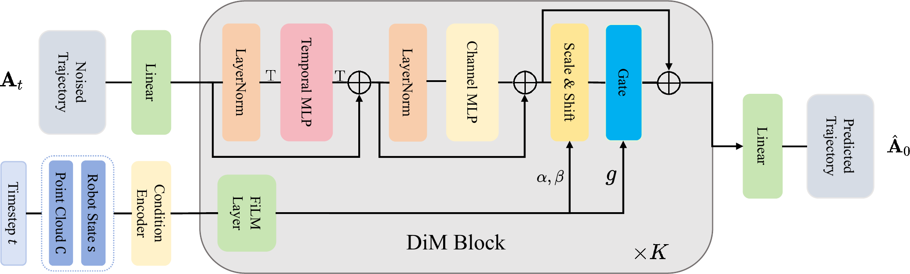

<h1 align="center">
  Hydra-DP3: Frequency-Aware Right-Sizing of 3D Diffusion Policies for Visuomotor Control
</h1>


<div align="center">


[](https://arxiv.org/abs/2605.01581)
[](https://www.apache.org/licenses/LICENSE-2.0)
</div>

---


## 📋 Overview
<p align="center">
  
  <br>
  <em>Hydra-DP3: Frequency-Aware Right-Sizing of 3D Diffusion Policies for Visuomotor Control</em>
</p>

**Hydra-DP3** is a compact 3D diffusion policy for visuomotor control. The paper studies the low-frequency structure of robot action trajectories and uses this perspective to motivate a lightweight Diffusion Mixer decoder and two-step DDIM inference. The decoder combines temporal and channel mixing with point-cloud and robot-state conditioning.

The expanded paper presents frequency-domain analysis, synthetic experiments, and evaluations on RoboTwin2.0, Adroit, MetaWorld, and real-world tasks. See the [paper](https://arxiv.org/abs/2605.01581) for the complete study.

The NeurIPS version is titled **Hydra-DP3**. The linked arXiv preprint is listed under **Hyper-DP3**; the citation below retains its published title.

### Code release and compatibility

This repository carries forward the [PocketDP3 code release](https://github.com/jhz1192/PocketDP3) under the Hydra-DP3 name. It contains the original RoboTwin integration; the model, training scripts, evaluation scripts, and default configurations are unchanged. The additional experiments discussed in the expanded paper are not bundled in this code release.

For compatibility with existing scripts and checkpoints, internal identifiers such as `PocketDP3/`, `pocket_diffusion_policy_3d`, the `PocketDP3` class, and `pocket_dp3.yaml` retain their original names. The supplied configuration already uses `DDIMScheduler` with `num_inference_steps: 2`.


## ⚙️ Installation

Our code is intended to be evaluated with the third-party benchmark [RoboTwin2.0](https://github.com/RoboTwin-Platform/RoboTwin). To reproduce results, you need to **copy** our policy folder into the RoboTwin repository and run RoboTwin’s training and evaluation scripts.

Clone our repository along with [RoboTwin](https://github.com/RoboTwin-Platform/RoboTwin):
```
git clone --recurse-submodules https://github.com/jhz1192/HydraDP3.git
cd HydraDP3
```

Set up the runtime environment using the scripts provided by RoboTwin  official doc:

```
conda create -n hydra-dp3 python=3.10 -y
conda activate hydra-dp3
cd RoboTwin
bash script/_install.sh
pip install zarr==2.12.0 wandb ipdb gpustat dm_control omegaconf hydra-core==1.2.0 dill==0.3.5.1 einops==0.4.1 diffusers==0.11.1 numba==0.56.4 moviepy imageio av matplotlib termcolor
```
Note that PyTorch3D must be installed successfully. For more detailed installation instructions, please refer to the official [doc](https://robotwin-platform.github.io/doc/usage/robotwin-install.html).

Download assets:
```
bash script/_download_assets.sh
```

After setting up the environment, copy the `PocketDP3` folder into RoboTwin’s `policy/` directory:
```
cd ..
cp -r PocketDP3 RoboTwin/policy/
```

Install the Hydra-DP3 policy package (legacy directory name) by running:
```
cd RoboTwin/policy/PocketDP3/Pocket-3D-Diffusion-Policy
pip install -e .
cd ../../..
```

## 🚀 Usage
### Collect Data
We use the data collection scripts provided by [RoboTwin](https://robotwin-platform.github.io/doc/usage/collect-data.html):

```
bash collect_data.sh ${task_name} ${task_config} ${gpu_id}
# Example: bash collect_data.sh beat_block_hammer demo_clean 0
```
Note: Please set `datatype.pointcloud` to `true` in `task_config/demo_clean.yml`.

### Training and Evaluation

We provide pipeline scripts for training and evaluation:

```
cd policy/PocketDP3
bash pipeline.sh ${gpu_id}
```

Alternatively, you can run training and evaluation separately:

1. **Prepare Training Data:**
```
cd policy/PocketDP3
bash process_data.sh ${task_name} ${task_config} ${expert_data_num}
# Example: bash process_data.sh beat_block_hammer demo_clean 50
```

2. **Train Hydra-DP3:**
```
bash train.sh ${task_name} ${task_config} ${expert_data_num} ${seed} ${gpu_id}
# bash train.sh beat_block_hammer demo_clean 50 0 0
```

3. **Evaluate Hydra-DP3:**
```
bash eval.sh ${task_name} ${task_config} ${ckpt_setting} ${expert_data_num} ${seed} ${gpu_id}
# bash eval.sh beat_block_hammer demo_clean demo_clean 50 0 0
```

All training and evaluation follow the official DP3 scripts provided by RoboTwin. If you encounter any issues, please refer to the official [RoboTwin DP3 documentation](https://robotwin-platform.github.io/doc/usage/DP3.html).


💡**Tips:** Model capacity is controlled by `policy.mlp_hidden_dim` and `policy.mlp_depth` in `pocket_dp3.yaml`. The checked-in configuration uses `mlp_hidden_dim=64` and `mlp_depth=4`; the original base setting uses `mlp_hidden_dim=128` and `mlp_depth=4`.


## 📈 Results

### Performance on RoboTwin2.0 Benchmark

The following **RoboTwin2.0** results are retained from the original PocketDP3 release, with model labels updated to Hydra-DP3. Numerical values and evaluation settings have not been changed. Refer to the [expanded paper](https://arxiv.org/abs/2605.01581) for its full benchmark results.

| Task | DP3 | **Hydra-DP3-tiny (Ours)** | Δ vs DP3 | **Hydra-DP3-base (Ours)** | Δ vs DP3 |
| :--- | :---: | :---: | :---: | :---: | :---: |
| Beat Block Hammer | 72.0% | **94.0%** | +22.0% | 92.0% | +20.0% |
| Click Alarmclock | 77.0% | 94.0% | +17.0% | **98.0%** | +21.0% |
| Click Bell | 90.0% | **100.0%** | +10.0% | **100.0%** | +10.0% |
| Hanging Mug | 17.0% | 29.0% | +12.0% | **39.0%** | +22.0% |
| Move Can Pot | 70.0% | 81.0% | +11.0% | **97.0%** | +27.0% |
| Move Pillbottle Pad | 41.0% | 45.0% | +4.0% | **53.0%** | +12.0% |
| Pick Diverse Bottles | 52.0% | **77.0%** | +25.0% | 74.0% | +22.0% |
| Pick Dual Bottles | 60.0% | 83.0% | +23.0% | **93.0%** | +33.0% |
| Place Bread Basket | 26.0% | **48.0%** | +22.0% | 41.0% | +15.0% |
| Place Bread Skillet | 19.0% | 38.0% | +19.0% | **52.0%** | +33.0% |
| Place Burger Fries | 72.0% | 74.0% | +2.0% | **86.0%** | +14.0% |
| Place Cans Plasticbox | 48.0% | **98.0%** | +50.0% | 95.0% | +47.0% |
| Place Empty Cup | 65.0% | 90.0% | +25.0% | **94.0%** | +29.0% |
| Place Object Stand | 60.0% | 61.0% | +1.0% | **72.0%** | +12.0% |
| Place Phone Stand | 44.0% | 55.0% | +11.0% | **63.0%** | +19.0% |
| Scan Object | 31.0% | 31.0% | +0.0% | **43.0%** | +12.0% |
| Stack Bowls Three | 57.0% | 63.0% | +6.0% | **72.0%** | +15.0% |
| Stamp Seal | 18.0% | 34.0% | +16.0% | **41.0%** | +23.0% |
| Turn Switch | 46.0% | **59.0%** | +13.0% | 56.0% | +10.0% |
| **Average** | 50.8% | **66.0%** | +15.2% | **71.6%** | +20.8% |

### 📊 Detailed Results on RoboTwin2.0
For a comprehensive breakdown of success rates across all tasks and different model sizes, please refer to our results page:

[**📂 View Detailed Performance Report**](https://htmlpreview.github.io/?https://github.com/jhz1192/HydraDP3/blob/main/assets/algorithm_results.html)

## 🎓 Citation

If you find Hydra-DP3 useful for your research, please kindly cite our paper:

```bibtex
@article{zhang2026hyperdp3,
  title={Hyper-DP3: Frequency-Aware Right-Sizing of 3D Diffusion Policies for Visuomotor Control},
  author={Zhang, Jinhao and Zhou, Zhexuan and Li, Huizhe and Lai, Yichen and Xia, Wenlong and Song, Haoming and Gong, Youmin and Mei, Jie},
  journal={arXiv preprint arXiv:2605.01581},
  year={2026},
  eprint={2605.01581},
  archivePrefix={arXiv},
  primaryClass={cs.RO},
  url={https://arxiv.org/abs/2605.01581}
}
```

## 📄 License

This project is licensed under the [Apache License 2.0](https://www.apache.org/licenses/LICENSE-2.0), as stated in the original release.

## 🌟 Acknowledgments
- [Robotwin](https://robotwin-platform.github.io/) for the simulation benchmark
- [DP3](https://github.com/YanjieZe/3D-Diffusion-Policy) for the strong baseline work

## ✉️ Contact

If you have any questions, please contact us at:
- Email: jinhaozhang0705@gmail.com
- GitHub Issues: [Open an issue](https://github.com/jhz1192/HydraDP3/issues)
