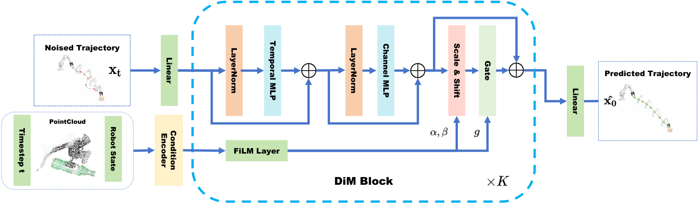

<h1 align="center">Hydra-DP3</h1>
<p align="center"><strong>Frequency-Aware Right-Sizing of 3D Diffusion Policies for Visuomotor Control</strong></p>

<p align="center">
  <a href="https://arxiv.org/abs/2605.01581"></a>
  <a href="https://www.apache.org/licenses/LICENSE-2.0"></a>
</p>

**Hydra-DP3** is the project name used for the NeurIPS version. This README follows [arXiv:2605.01581v4](https://arxiv.org/abs/2605.01581v4), where the method is named **Hyper-DP3 (HDP3)**. All performance tables below refer to the paper's **2.52M-parameter model**.

## Overview

Robot action trajectories are smooth: in the paper's RoboTwin2.0 analysis, the first two non-DC DCT modes contain **98.5%** of trajectory energy. A frequency-domain analysis relates denoising error to the dimension of the low-frequency subspace and the remaining high-frequency energy, motivating a smaller decoder and fewer sampling steps.

Hydra-DP3 combines the DP3 point-cloud encoder with a lightweight **Diffusion Mixer (DiM)** decoder. Each block mixes temporal and channel information, then injects conditioning through FiLM and a gated residual connection. The policy predicts clean action trajectories and uses **two-step DDIM inference**, without consistency distillation or MeanFlow training.

<p align="center">
  <a href="assets/architecture.pdf"></a>
  <br>
  <em>Architecture from <a href="https://arxiv.org/html/2605.01581v4#S4.F2">Figure 2 of arXiv v4</a>. <a href="assets/architecture.pdf">Vector PDF</a>.</em>
</p>

The paper reports **2.52M parameters**, **4.50 ms inference latency** on an RTX 5880 Ada at batch size 1, **63.2% average success on 50 RoboTwin2.0 tasks**, and **78.4% across 10 Adroit/MetaWorld tasks**. It also includes synthetic trajectory experiments and real-robot evaluations. See [Sections 4–6](https://arxiv.org/html/2605.01581v4#S4) for the analysis and experiments.

## Results

### Model size and inference latency

[Paper, Table 3](https://arxiv.org/html/2605.01581v4#S6.T3). Measurements use a single **NVIDIA RTX 5880 Ada**, **batch size 1**. NFE is the number of denoiser evaluations per action prediction.

| Method | Parameters (M) ↓ | NFE | Latency (ms) ↓ |
| :--- | ---: | ---: | ---: |
| DP | 85.6 | 100 | 460 |
| DP3 | 255.8 | 10 | 51.4 |
| Flow Policy | 255.8 | 1 | 7.04 |
| MP1 | 255.8 | 1 | 7.02 |
| **Hydra-DP3 (Ours)** | **2.52** | **2** | **4.50** |

### RoboTwin2.0

The paper uses **50 expert demonstrations per task** and evaluates each task on **100 randomly generated scenes**. The selected tasks below use the values in [Table 1 and Appendix E](https://arxiv.org/html/2605.01581v4#A5); the final row is the mean over **all 50 tasks**, not just the six displayed tasks. Differences are in percentage points (pp).

| Task | DP3 | Hydra-DP3 (2.52M) | Δ vs. DP3 (pp) |
| :--- | ---: | ---: | ---: |
| Open Microwave | 61.0% | **92.0%** | +31.0 |
| Hanging Mug | 17.0% | **35.0%** | +18.0 |
| Move Pillbottle Pad | 41.0% | **56.0%** | +15.0 |
| Stamp Seal | 18.0% | **43.0%** | +25.0 |
| Beat Block Hammer | 72.0% | **88.0%** | +16.0 |
| Place Phone Stand | 44.0% | **65.0%** | +21.0 |
| **Average over all 50 tasks** | **55.2%** | **63.2%** | **+8.0** |

[View all 50 task results](https://htmlpreview.github.io/?https://github.com/jhz1192/HydraDP3/blob/main/assets/algorithm_results.html) · [Results HTML source](assets/algorithm_results.html)

### Adroit and MetaWorld

[Paper, Table 2](https://arxiv.org/html/2605.01581v4#S5.T2). Training uses **10 demonstrations per task** and **three seeds (0, 1, 2)**. Policies are evaluated every 200 epochs with 20 rollouts per task; the reported metric averages the five best evaluation success rates for each seed, then averages across seeds.

| Benchmark | Task | DP3 | Hydra-DP3 (2.52M) |
| :--- | :--- | ---: | ---: |
| Adroit | Hammer | 100.0% | 100.0% |
| Adroit | Door | 62.0% | 57.3% |
| Adroit | Pen | 43.7% | 48.7% |
| MetaWorld | Assembly | 99.6% | 100.0% |
| MetaWorld | Disassemble | 75.0% | 87.7% |
| MetaWorld | Hand-Insert | 25.3% | 33.3% |
| MetaWorld | Pick-Place-Wall | 82.7% | 88.7% |
| MetaWorld | Push | 71.3% | 83.0% |
| MetaWorld | Reach-Wall | 70.7% | 85.0% |
| MetaWorld | Stick-Push | 100.0% | 100.0% |
| **All 10 tasks** | **Average** | **73.0%** | **78.4%** |

## Code release

This repository provides the **RoboTwin2.0 policy implementation** carried forward from [PocketDP3](https://github.com/jhz1192/PocketDP3). The policy lives in `HydraDP3/`, its Python package is `hydra_diffusion_policy_3d`, and training and evaluation use `hydra_dp3.yaml`. The Adroit, MetaWorld, synthetic-data, and real-robot experiments are described in the paper; their experiment pipelines are not included in this release.

## Installation

Clone the repository and its pinned RoboTwin submodule:

```bash
git clone --recurse-submodules https://github.com/jhz1192/HydraDP3.git
cd HydraDP3
```

Follow the [RoboTwin installation documentation](https://robotwin-platform.github.io/doc/usage/robotwin-install.html), including the PyTorch3D setup:

```bash
conda create -n hydra-dp3 python=3.10 -y
conda activate hydra-dp3
cd RoboTwin
bash script/_install.sh
pip install zarr==2.12.0 wandb ipdb gpustat dm_control omegaconf hydra-core==1.2.0 dill==0.3.5.1 einops==0.4.1 diffusers==0.11.1 numba==0.56.4 moviepy imageio av matplotlib termcolor
bash script/_download_assets.sh
```

Copy the policy into RoboTwin and install it:

```bash
# From HydraDP3/RoboTwin
cd ..
cp -r HydraDP3 RoboTwin/policy/
cd RoboTwin/policy/HydraDP3/Hydra-3D-Diffusion-Policy
pip install -e .
cd ../../..
# Now in HydraDP3/RoboTwin
```

## Paper settings and reproduction

The paper uses **DiM hidden width 128 and depth 6** (Section 6.1). Its RoboTwin2.0 settings are listed below, with the remaining hyperparameters from [Appendix C, Table 8](https://arxiv.org/html/2605.01581v4#A3.T8).

| Setting | RoboTwin2.0 value |
| :--- | :--- |
| DiM hidden width / depth | 128 / 6 |
| MLP expansion ratio | 4 |
| Encoder output / diffusion timestep embedding dimension | 64 / 64 |
| Training diffusion steps / inference steps | 100 / 2 |
| Prediction horizon / executed action steps | 8 / 6 |
| Observation steps | 3 |
| Batch size | 256 |
| Training epochs | 3,000 |
| Optimizer / learning rate | AdamW / 1e-4 |
| Weight decay / warmup steps | 1e-6 / 500 |
| Learning-rate schedule | Cosine |

**The inherited YAML defaults differ from the paper:** they use hidden width 64, depth 4, batch size 128, and 2 observation steps. Before training with the paper settings, edit these fields in the existing `RoboTwin/policy/HydraDP3/Hydra-3D-Diffusion-Policy/hydra_diffusion_policy_3d/config/hydra_dp3.yaml`, retaining all other fields:

```yaml
n_obs_steps: 3

policy:
  mlp_hidden_dim: 128
  mlp_depth: 6

dataloader:
  batch_size: 256
```

This is a field-update excerpt, not a replacement for the full configuration. The inherited settings already use a horizon of 8, 6 action steps, DDIM with 100 training steps and 2 inference steps, and the optimizer settings above. Keep the same model configuration for training and evaluation, since evaluation also reads `hydra_dp3.yaml`. **Parameter-count note:** Table 3 reports 2.52M parameters, while Appendix C specifies 3 observation steps. Instantiating this released implementation with width 128 and depth 6 gives **2,517,118 parameters with 2 observation steps**, or **2,533,502 with 3**. To use the architecture corresponding to the original 2.5171M result column, keep `n_obs_steps: 2`; the excerpt above follows the appendix's 3-step setting. The performance tables reproduce the paper's reported results and are not new benchmark runs of this repository.

### Collect data

From `HydraDP3/RoboTwin`, set `datatype.pointcloud: true` in the task configuration (for example, `task_config/demo_clean.yml`), then run the [RoboTwin data collection workflow](https://robotwin-platform.github.io/doc/usage/collect-data.html):

```bash
bash collect_data.sh ${task_name} ${task_config} ${gpu_id}
# Example:
bash collect_data.sh beat_block_hammer demo_clean 0
```

### Train and evaluate a task

From `HydraDP3/RoboTwin`:

```bash
cd policy/HydraDP3

# Prepare 50 expert demonstrations.
bash process_data.sh beat_block_hammer demo_clean 50

# Train: task, task_config, expert_data_num, seed, gpu_id.
bash train.sh beat_block_hammer demo_clean 50 0 0

# Evaluate: task, task_config, ckpt_setting, expert_data_num, seed, gpu_id.
bash eval.sh beat_block_hammer demo_clean demo_clean 50 0 0
```

The included `pipeline.sh` runs its predefined **19-task subset**. It does not reproduce the paper's 50-task average by itself. Use the task-level commands for every task in the [full results table](assets/algorithm_results.html) when evaluating the complete benchmark. Further benchmark instructions are available in the [RoboTwin DP3 documentation](https://robotwin-platform.github.io/doc/usage/DP3.html).

## Citation

Please cite the linked arXiv paper. Its bibliographic title is retained below as published:

```bibtex
@article{zhang2026hyperdp3,
  title={Hyper-DP3: Frequency-Aware Right-Sizing of 3D Diffusion Policies for Visuomotor Control},
  author={Zhang, Jinhao and Zhou, Zhexuan and Li, Huizhe and Lai, Yichen and Xia, Wenlong and Song, Haoming and Gong, Youmin and Mei, Jie},
  journal={arXiv preprint arXiv:2605.01581},
  year={2026},
  eprint={2605.01581},
  archivePrefix={arXiv},
  primaryClass={cs.RO},
  url={https://arxiv.org/abs/2605.01581}
}
```

## License

This project follows the [Apache License 2.0](https://www.apache.org/licenses/LICENSE-2.0) declaration in the original release.

## Acknowledgments

- [RoboTwin](https://github.com/RoboTwin-Platform/RoboTwin) for the simulation benchmark.
- [3D Diffusion Policy (DP3)](https://github.com/YanjieZe/3D-Diffusion-Policy) for the baseline implementation.

## Contact

- Email: jinhaozhang0705@gmail.com
- [GitHub Issues](https://github.com/jhz1192/HydraDP3/issues)
